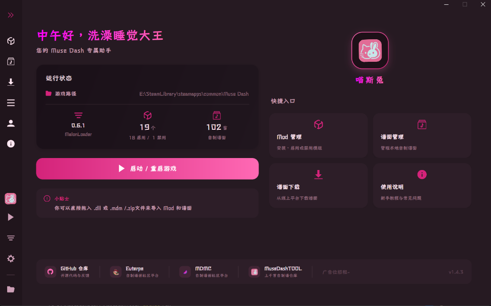
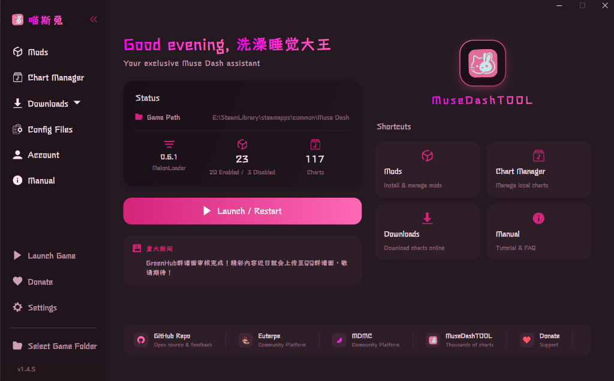

  
[English](README_EN.md) | [简体中文](README.md)

# MuseDashTOOL (喵斯兔)

**一个为《喵斯快跑》(Muse Dash) 设计的现代、功能强大且易于使用的模组管理平台。**

---

### 🎨 界面预览

<!-- 这里可以放你的截图 -->

## ✨ 核心特性

- 🚀 **极速体验**：深度优化的文件扫描与列表加载逻辑。
- 📦 **模组管理**：支持一键导入、启用/禁用、以及批量删除模组。
- 🎵 **谱面管理**：支持快速下载、试听MDMC社区的谱面；支持试听，点赞，下载Euterpe社区的谱面；且特别加入国内谱师的曲包整合包提供下载。
- 📁 **谱面分组**：支持自由创建与管理谱面分组，实现多维度的谱面整理。
- 🔧 **配置编辑**：内置直观的模组配置文件编辑器，无需手动翻找 JSON/cfg。
- 🌍 **智能翻译**：自动调用在线翻译服务，轻松阅读外语模组描述。
- 🎨 **个性化**：支持自定义背景图片、模糊度、字体以及主题色调。
- 🌐 **多语言支持**：原生支持中文与英文界面，可在设置中无缝切换。

## 🛠️ 快速开始

### 环境要求
- Windows 10/11 (x64)
- 游戏版本：Steam 版 Muse Dash
- 已安装 [MelonLoader](https://melonwiki.xyz/#/) (MuseDashTOOL也可协助你一键安装)

### 安装步骤
1. 前往 [Releases](https://github.com/Suzimo506/MuseDashTOOL/releases) 页面下载最新的压缩包。
2. 解压到任意目录（**请勿解压到游戏根目录**）。
3. 运行 `MuseDashTOOL.exe`，首次启动请按提示选择游戏所在目录。

## ☕ 打赏支持

如果你觉得喵斯兔对你有帮助，并且希望支持它的后续维护（如QQ群谱面云存储、加速域名租赁、CDN和后续开发等），可以通过以下方式打赏作者。即使不打赏，作者也承诺**喵斯兔将永久免费并长期维护**！(๑>◡<๑)

> 💡 **提示**：由于微信/支付宝不支持自动获取打赏者姓名，如果您转账时备注了姓名，作者会手动将您的名字加入到软件的赞助者名单中。感谢您的支持！

| 支付宝 (Alipay) | 微信支付 (WeChat Pay) |
| :---: | :---: |
|  |  |

## 🤝 参与贡献

如果你有好的想法或发现了 Bug，欢迎提交 [Issue](https://github.com/Suzimo506/MuseDashTOOL/issues) 或发起 [Pull Request](https://github.com/Suzimo506/MuseDashTOOL/pulls)。

---

An open-source initiative dedicated to the Muse Dash modding ecosystem.

