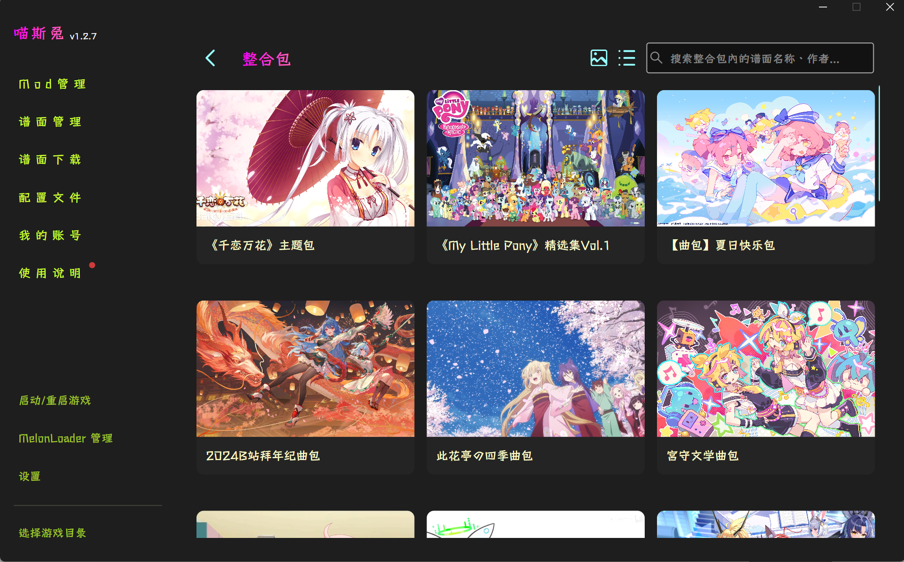

  
[English](README_EN.md) | [简体中文](README.md)

# MuseDashTOOL

**A modern, powerful, and easy-to-use modding platform designed for Muse Dash.**

---

### 🎨 Preview

## ✨ Key Features

- 🚀 **Blazing Fast**: Deeply optimized file scanning and list loading logic.
- 📦 **Mod Management**: One-click import, enable/disable, and batch deletion of mods.
- 🎵 **Chart Management**: Support fast download and preview of charts from MDMC community; specially added song pack collections from local charter.
- 🔧 **Config Editor**: Built-in intuitive mod configuration editor, no need to manually edit JSON/cfg files.
- 🌍 **Smart Translation**: Automatically use online translation services to easily read foreign mod descriptions.
- 🎨 **Personalization**: Support custom background images, blur, fonts, and theme colors.

## 🛠️ Quick Start

### Requirements
- Windows 10/11 (x64)
- Game Version: Steam version of Muse Dash
- [MelonLoader](https://melonwiki.xyz/#/) installed (MuseDashTOOL can also help you install it with one click)

### Installation
1. Go to the [Releases](https://github.com/Suzimo506/MuseDashTOOL/releases) page and download the latest package.
2. Extract to any directory (**Do NOT extract to the game root directory**).
3. Run `MuseDashTOOL.exe`, and follow the prompts to select your game directory on first launch.

## 🤝 Contributing

If you have great ideas or find a bug, feel free to submit an [Issue](https://github.com/Suzimo506/MuseDashTOOL/issues) or a [Pull Request](https://github.com/Suzimo506/MuseDashTOOL/pulls).

---

An open-source initiative dedicated to the Muse Dash modding ecosystem.

